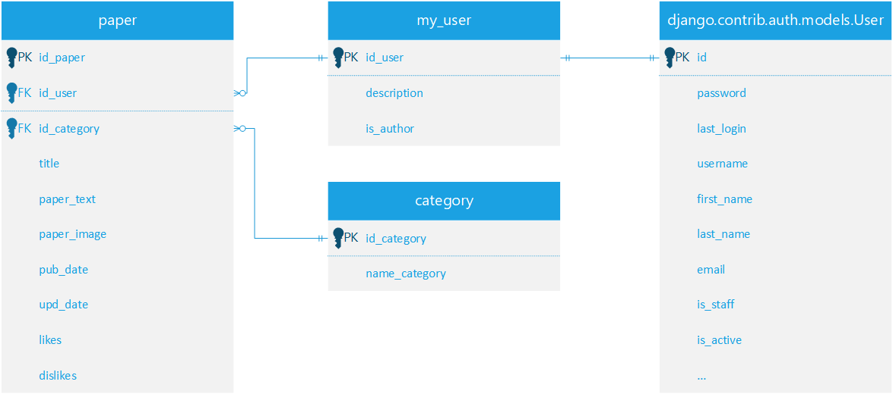

# Учебный проект AbstractBlog
Цель проекта закрепить на практике владение технологиями DRF, unittest, PostgreSQL, flake8 и закрепить практики разработки - тестирования, документация кода, спроектировать масштабируемую архитектуру 

В процессе разработки пришёл к следующей архитектуре:  
Простейший CRUD функционал реализуется готвыми средствами DRF - миксинами  
Более сложные задачи - валидация, филтрация по парамтрам из запроса, реализуются следующим образом:  
В views прописан вызов бизнес логики приложения:  
> получить парметры -> проверить их корректность -> найти запись в бд -> сериализовать -> отдать

Реализация перечисленных шагов, помещена в отдельном файле service 

## ТЗ
Сайт должен иметь следующие конечные точки   

 - Получение статьей
   - Поиск с фильтрами по названию, дате публикации, категории
   - Сортировка по одному из фильтров
   - Список последних N опубликованных статей
   - Получение статьи по id
 - Публикация статьи для авторизированных пользователей
 - Авторизация
   - Указание никнейма, пароля, опционально ФИО, описание

Модель данных:
 - Статья
   - Статья **обязательно** имеет название, дату публикации, id имя автора, статью)
   - Статья **опционально** имеет превью - изображение
   - Поля лайков и дизлайков
 - Пользователь
   - Обязательные: никнейм, пароль
   - Опционально: описание, ФИО
## Схема БД



# BlogApi
core path: 
 > abstractblog/api/v1

## Объекты 
**paper** - полная информация о статье
```
paper: {
  id_paper: int,
  author={
    id_author: int,
    author_name: string
  },
  content: {
    paper_image: ???,
    paper_text: string
  },
  title: string,
  likes: int,
  dislikes: int,
  pub_date: string [YYYY-MM-DD],
  upd_date: string [YYYY-MM-DD],
  cat_id: int,
  cat_name: string,
}
```
**meta_paper** - мета информация о статье, как paper только без поля content
```
meta_paper: {
  id_paper: int,
  author: {
    id_author: int,
    author_name: string
  },
  title: string,
  likes: int,
  dislikes: int,
  pub_date: string [DD-MM-YYYYTHH:MM:SS],
  upd_date: string [DD-MM-YYYYTHH:MM:SS],
  cat_id: int,
  cat_name: string,
}
```

<!-- **user** - информация о пользователе
```
user: {
  id_user: int,
  name: string,
  description: string,
  is_author: bool
}
``` -->

## Endpoints
> ### GET paper/
Информация о срезе опубликованных статьей  
Параметры:  
- **offset**: int, От какой по номеру записи возвращать статьи
- **limit**: int,  До какой по номеру записи возвращать статьи
- **filter**: string[name_category], Фильтр по названию категории  

Возвращает список мета информации о статьях  
```
[meta_paper, ...]
```
> ### GET paper/\<int:id\>
Возвращает paper по указанному id
```
paper
```

> ### GET paper/find
Поиск по названию статьи по одному или более параметров    
Обязателен любой из первых трёх параметров    
Параметры:
- **title**: string
- **category**: string
- **pub_date**: string [YYYY-MM-DD]
- **order_by**: str['title', 'category', 'pub_date']
- **desc**: bool

Возвращает список metapaper  
```
[metapaper, ...]
```

> ### GET category/  
Список доступных категорий и их id  
```
[
  [
    id: int, 
    name_category: string
    ],  
  ...
]
```

> ### POST paper_create/
Публикует статью  
data:  
```
{
    "category": {
        "name_category": ""
    },
    "title": "",
    "paper_text": "",
    "paper_image": null,
    "user": null
}
```
